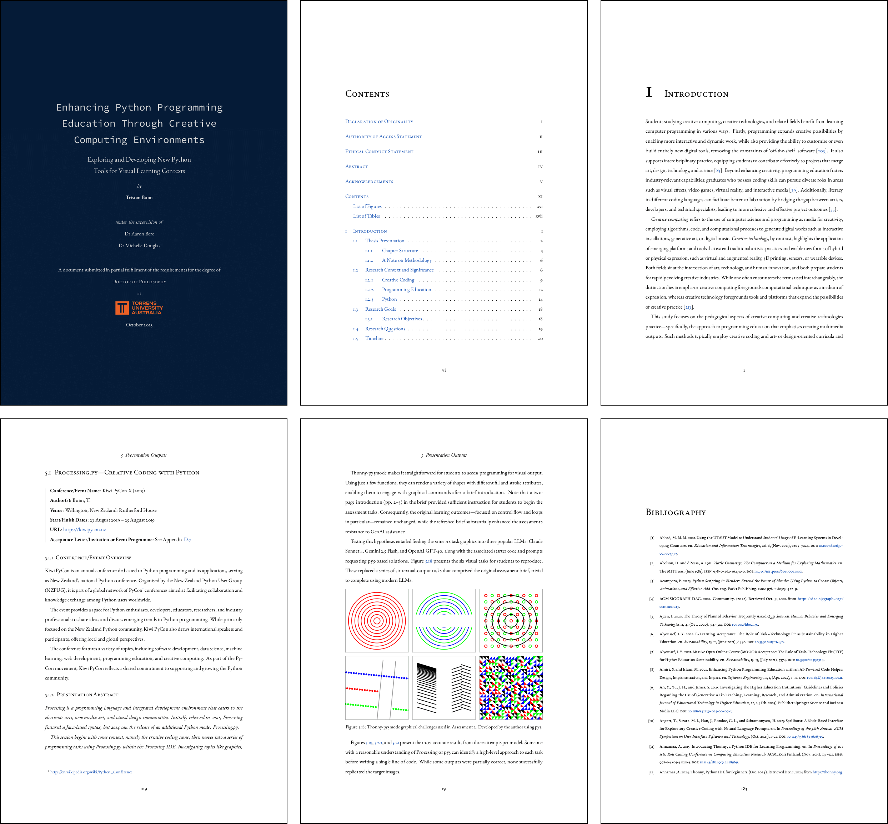

# phd-latex

*A PhD LaTeX thesis template based on Mimosis*

This repository contains a customized PhD thesis template adapted from the excellent *Mimosis* by Bastian Rieck.

All credit for the original design goes to the [Mimosis](https://github.com/Pseudomanifold/latex-mimosis) project; this version adds personal adaptations and workflow tweaks.



## Sample

A compiled example thesis is available here:

[compiled-thesis.pdf](https://raw.githubusercontent.com/tabreturn/phd-latex/main/compiled-thesis.pdf)

---

## Requirements

A reasonably recent LaTeX distribution.

---

## Build

From the repository root:

```bash
cd phd-latex
latexmk
```

This will compile `thesis.tex` and produce `thesis.pdf`.

---

## Cleaning

Remove auxiliary files while keeping the PDF:

```bash
latexmk -c
```

Remove all generated files (including the PDF):

```bash
latexmk -C
```

